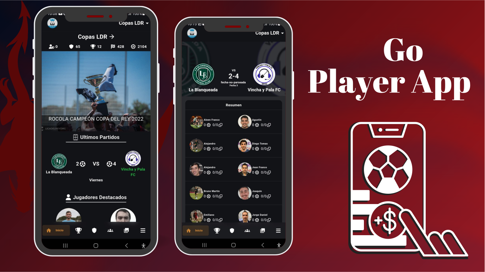
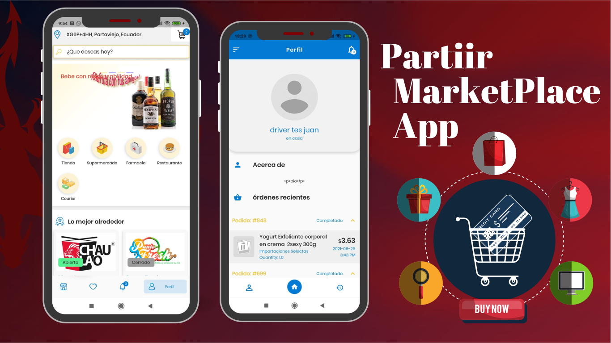

<h1 align="center">Hi, Im <a href="https://aristi.dev">FreddyMurillo (GrougalQatal)</a> 👋</h1>

<!---->
<!---->

## About me

- ⭐ Computer Science Engineer ⭐ 
- 📲 FrontEnd developer (flutter Enthusiast - web and mobile)
- ✏️ Project Manager in progress. Studying on the [OBS Business School](https://www.obsbusiness.school/en/)
<!--##- 🎥 Te enseño a programar apps en [Youtube](https://youtube.com/aristidevs?sub_confirmation=1) (+45k subs)
- ✏️ Y por escrito en [CursoKotlin](https://cursokotlin.com)
- 📗 Autor del libro [Iniciación a Android en Kotlin. Casos prácticos](https://www.paraninfo.es/catalogo/9788428340922/iniciacion-a-android-en-kotlin--casos-practicos)
- 🧑‍🏫 Creador de [AppCademy](https://appcademy.dev)-->
 

### ⚙️ &nbsp;GitHub Analytics

## Projects
<table>
<tr>
<td width="50%">
<h3 align="center">Go Player App</h3>

 

GoPlayer is an innovative application designed to manage soccer leagues and view matches easily and efficiently. With <strong>GoPlayer</strong>, users can <strong>create and manage leagues, schedule matches, record results, and access real-time statistics. </strong> The user-friendly interface allows fans to follow their favorite teams and enjoy the excitement of soccer anytime, anywhere.

                                                                                      
</td>

<td width="50%">
 
<h3 align="center">Partiir Marketplace App</h3>

                                       

 

Las arquitecturas son <strong>IMPRESCINDIBLES</strong> para poder trabajar como desarrollador/a Android. En este curso, divido por ramas irás aprendiendo a implementar una arquitectura real y robusta con inyección de dependencias, clean architecture, testing y mucho más.

                                                             
</table>                                                                                 

 

<table>
<tr>
<td width="50%">
<h3 align="center">Curso Android Intermedio</h3>

Aprende a programar aplicaciones <strong>Android con Kotlin nivel intermedio</strong> - En este curso nos centraremos en las <strong>buenas prácticas, arquitectura y testing</strong>. Curso <strong>GRATUITO de 8 horas</strong> con todo el código disponible para descargar.

                                                                                      
</td>       

<td width="50%">
<h3 align="center">Curso Kotlin Multiplatform</h3>

Aprende a programar aplicaciones <strong>multiplataform con Kotlin y Jetpack Compose</strong> - En este curso nos centraremos en dominar Kotlin Multiplatform <strong>desde cero</strong>. Curso <strong>GRATUITO</strong> (en desarrollo) con todo el código disponible para descargar.

                                                                                      
</td>  
</table>                                                                                 

 

<!--
**FreddyMurillo23/FreddyMurillo23** is a ✨ _special_ ✨ repository because its `README.md` (this file) appears on your GitHub profile.

Here are some ideas to get you started:

- 🔭 I’m currently working on ...
- 🌱 I’m currently learning ...
- 👯 I’m looking to collaborate on ...
- 🤔 I’m looking for help with ...
- 💬 Ask me about ...
- 📫 How to reach me: ...
- 😄 Pronouns: ...
- ⚡ Fun fact: ...
-->
